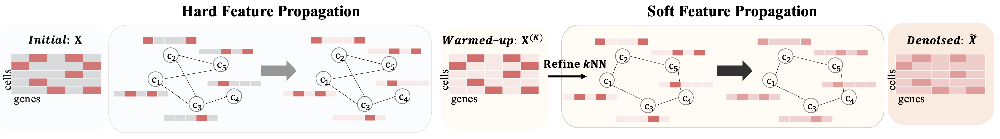

# Single-cell RNA-seq data imputation using Feature Propagation

<p align="center">
    <a href="https://pytorch.org/" alt="PyTorch">
    </a>
    

The official source code for "Single-cell RNA-seq data imputation using Feature Propagation", accepted at 2023 ICML Workshop on Computational Biology (Contributed talk, Best Paper).

## Overview

While single-cell RNA sequencing provides an understanding of the transcriptome of individual cells, its high sparsity, often termed dropout, hampers the capture of significant cell-cell relationships. Here, we propose scFP (single-cell Feature Propagation), which directly propagates features, i.e., gene expression, especially in raw feature space, via cell-cell graph. Specifically, it first obtains a warmed-up cell-gene matrix via Hard Feature Propagation which fully utilizes known gene transcripts. Then, we refine the k-Nearest Neighbor (kNN) of the cell-cell graph with a warmed up cell-gene matrix, followed by Soft Feature Propagation which now allows known gene transcripts to be further denoised through their neighbors. Through extensive experiments on imputation with cell clustering tasks, we demonstrate our proposed model, scFP, outperforms various recent imputation and clustering methods

</img>

## Requirements
- Python version : 3.9.16
- Pytorch version : 1.10.0
- scanpy : 1.9.3

## Download data

Create the directory to save dataset.
```
mkdir dataset
```

You can download preprocessed data [here](https://www.dropbox.com/sh/eaujyhthxjs0d5g/AADzvVv-h2yYWaoOfs1sybKea?dl=0)

## How to Run

You can simply reproduce the result with following codes  
```
git clone https://github.com/Junseok0207/scFP.git
cd scFP
sh run.sh
```

## Hyperparameters

`--name:`
Name of the dataset.  
usage example :`--dataset baron_mouse`

`--k:`
Number of neighbors in cell-cell graph  
usage example :`--k 5`

`--iter:`
Number of iterations in feature propagation
usage example :`--iter 40`

Using above hyper-parmeters, you can run our model with following codes  

```
python main.py --name baron_mouse --k 15 --iter 40
```

